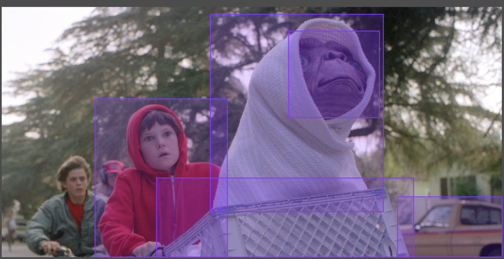
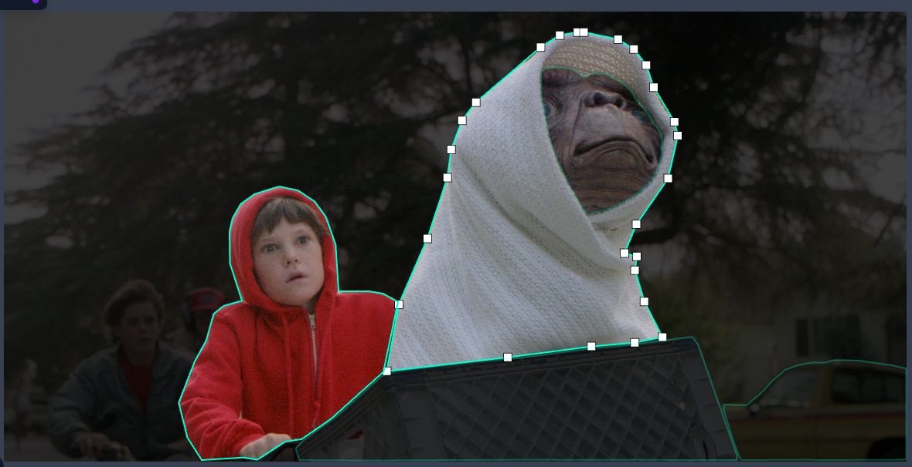

# YOLO + SAM tools
Tools for creating polygon annotations to train a YOLO instance segmentation model 

The main tool is ***redoYOLOPolygonsWithSAM.py***.  It is designed to redo polygon and bbox annotations with Meta's SAM model.  For example, maybe you have an instance segmentation model that gives mediocre polygon annotations, or have a model that only gives bboxes, or have a library of mediocre or bbox annotations from Roboflow Universe but what you need are nice polygon annotations... or maybe you *just don't feel like creating polygon annotations for everything*.  This tool will convert any of those sources into polygon annotations using SAM, and then optimize the output to be hand editable.  

The tool uses the process:
1. Convert all existing YOLO polygons into bounding boxes (existing bbox annotations will be used as is)
2. Use the bounding boxes with the very mature SAM model to give us new masks
3. Convert those masks BACK AGAIN into YOLO polygon annotations, hopefully improving them
4. Optimize those polygons so they are not too noisy and can still be hand corrected in roboflow or labelbox etc

**INPUT: Yolo bounding box and/or polygon annotations**

**OUTPUT: All annotations redone using Meta's SAM model**

**Vertices are cleaned up to allow hand editing in Labelbox/Roboflow/etc after running**

# To use, install with pip:

pip install ultralytics

pip install visvalingamwyatt  //for curve simplifying/optimizing YOLO output

pip install image //post processing needs

pip install transformers

pip install segment-anything

# Download:
sam_vit_h_4b8939.pth

You can get it here:
https://dl.fbaipublicfiles.com/segment_anything/sam_vit_h_4b8939.pth

# Point paths:
Go into **redoYOLOPolygonsWithSAM.py** and set your paths accordingly.

NOTE: Make sure to change the *sam_checkpoint* path variable as well to point to where you downloaded *sam_vit_h_4b8939.pth*

